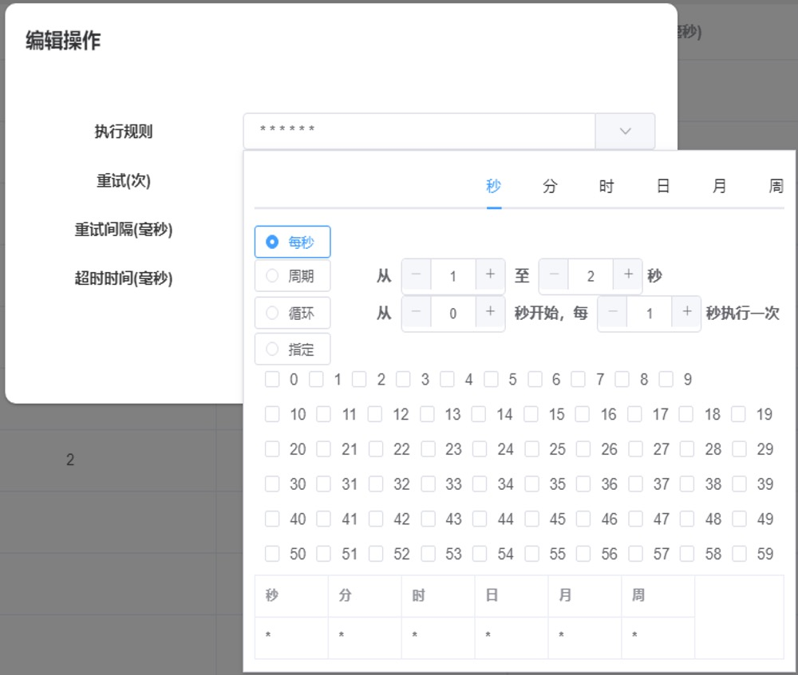

# 常见问题
## 1、选择器如何使用？
- 在左侧属性面板点击选择目标 
- 随后鼠标在其他软件个界面或者网页上停留就会出现高亮区域 
- 再单击鼠标左键就可以完成元素选择

## 2、执行器如何设置定时
- 在项目库界面，点击项目列表 
- 找到要设置定时的项目，点击编辑 
- 在编辑操作界面中的执行规则可以设置项目的执行时间 

## 3、插件如何定制开发
- 一个插件包由主程序代码和package.json配置文件组成（详细配置请查看[开发规范](./plugin.md)）
- 主程序代码就是向外暴露可以执行的方法，一个方法就对应一个操作
- 将开发好插件复制到插件目录下，在设计器下便可以看到插件定义的组件
- 也可以将插件压缩成zip文件，并在UiAuto的插件库点击“导入插件”，可以将插件导入到插件目录并上传到去端